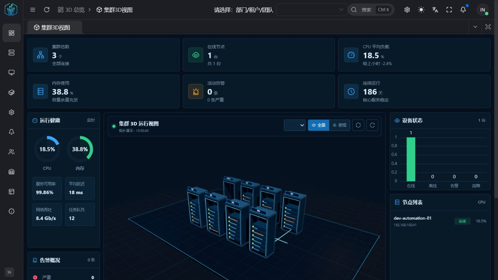
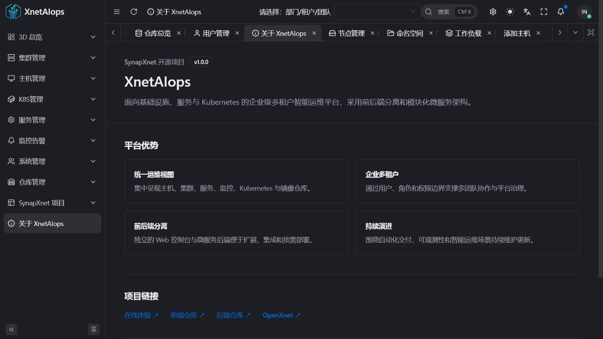
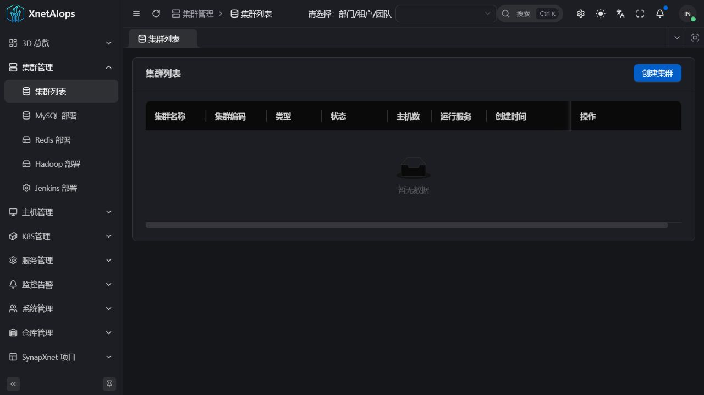
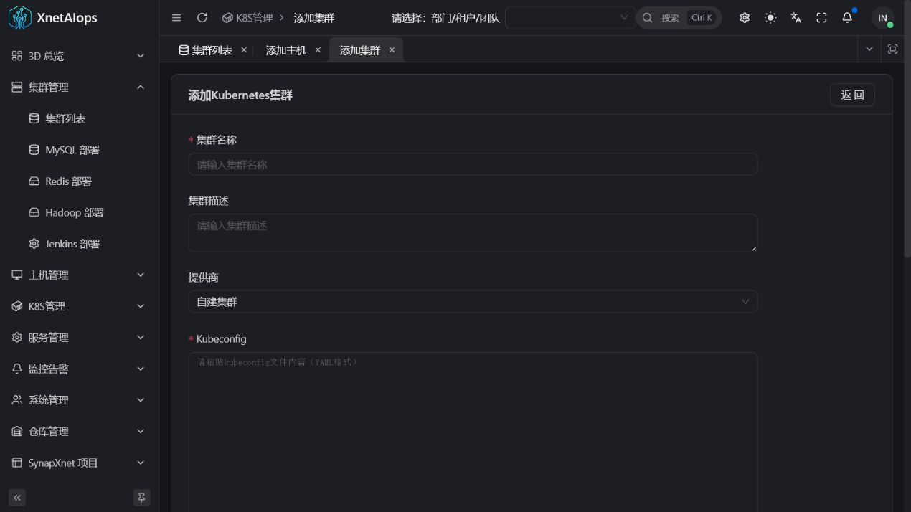
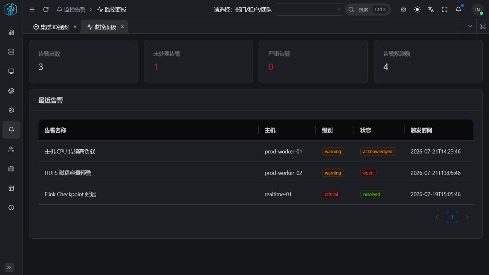

<div align="center">

[简体中文](./README.md) | [English](./README.en-US.md) | **日本語**

# XnetAIops

**インフラ、サービス、Kubernetes を統合するオープンソース AIOps**

[](https://www.xnetaiops.synapxnet.cn)
[](https://www.oracle.com/java/)
[](https://spring.io/projects/spring-boot)
[](./LICENSE)

[オンラインデモ](https://www.xnetaiops.synapxnet.cn) · [フロントエンド: XnetAIops-web](https://github.com/synapxnet/XnetAIops-web) · [OpenXnet](https://openxnet.synapxnet.com) · [ライセンス](./LICENSE)

</div>



## 画面プレビュー

| デモログイン | プロジェクト情報 |
| --- | --- |
|  |  |
| クラスター管理 | ホスト登録 |
|  |  |
| Kubernetes | サービス編成 |
|  |  |
| 監視とアラート | イメージレジストリ |
|  |  |
| マルチテナントユーザー | Kubernetes ノード |
|  |  |
| Kubernetes 名前空間 | Kubernetes ワークロード |
|  |  |

## 概要

XnetAIops は **SynapXnet チーム**が開発・公開する運用管理プラットフォームです。サーバー、ミドルウェア、業務サービス、Kubernetes、監視、イメージレジストリを一つのワークスペースで管理できます。

本リポジトリはバックエンドです。[XnetAIops-web](https://github.com/synapxnet/XnetAIops-web) と組み合わせることで、企業向けのマルチテナント、フロントエンド・バックエンド分離システムを構成します。

## GOAI Competition 1.0.0

`GOAI-Competition` ブランチは、アラート、Kubernetes ワークロード、サービス正常性を取得する読み取り専用 Agent ツールを追加します。すべての呼び出しは共通の `ToolResponse 1.0.0`、Workspace/Incident/Trace コンテキスト、短期かつ単一ツール限定の委任トークンを使用します。

[引き継ぎ、Fixture、API 例、検証結果](./docs/goai-handoff/HANDOFF-GOAI-COMPETITION-1.0.0.md) · [対応する証拠 UI](https://github.com/synapxnet/XnetAIops-web/tree/GOAI-Competition)

## 特長

- **企業向けマルチテナント:** ユーザー、ロール、チーム、リソース境界を統合管理。
- **フロントエンド・バックエンド分離:** 既存ゲートウェイやインフラへ柔軟に統合。
- **モジュール構成:** インフラ、サービス、Kubernetes、監視、レジストリを独立して拡張。
- **コンテナ配備:** Maven と Docker Compose による再現可能な導入。
- **継続的な更新:** 自動化、可観測性、セキュリティ、ドキュメントを継続改善。

## モジュール

| モジュール | サービス | 主な機能 |
| --- | --- | --- |
| CLM | `aiops-clm-service` | クラスターライフサイクル、MySQL、Redis、Hadoop、Jenkins |
| HOM | `aiops-hom-service` | ホスト、ラック、SSH 接続、リソース台帳 |
| SVM | `aiops-svm-service` | サービス定義、ロール割当、コマンド、ライフサイクル |
| MON | `aiops-mon-service` | 監視ダッシュボード、アラートルール、履歴、通知 |
| K8S | `aiops-k8s-service` | クラスター、Helm、監視、アラート、アプリ、パイプライン |
| REG | `aiops-reg-service` | レジストリ、プロジェクト、タグ、同期、配備履歴 |
| USR | `aiops-usr-service` | 認証、ユーザー、ロール、アクセス制御 |

## クイックスタート

JDK 17+、Maven 3.9+、Docker Compose、MySQL 8.x、Redis 7.x が必要です。

```bash
mvn -DskipTests package
cp .env.example .env
docker compose up -d --build
docker compose ps
```

演示用データは `sql/xnet_aiops_demo.sql` にあります。到達不能なデモ用アドレスと無効なプレースホルダー認証情報のみを使用し、ユーザー作成データを上書きせず再実行できます。

## デモ

- URL: <https://www.xnetaiops.synapxnet.cn>
- 電話番号: `12345678900`
- 確認コード: `000000`

固定確認コードは公開デモ専用です。本番環境では安全な認証プロバイダーを利用してください。

## コミュニティとライセンス

XnetAIops は [OpenXnet](https://openxnet.synapxnet.com) オープンソースエコシステムの一部です。

[MIT License](./LICENSE) の下で公開されています。Copyright © 2026 SynapXnet.
