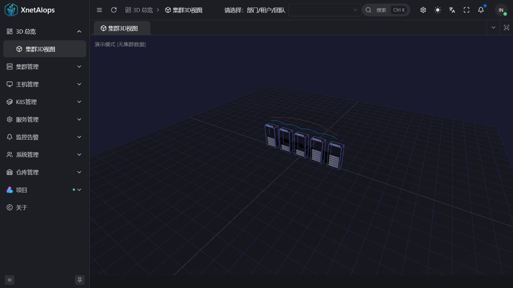
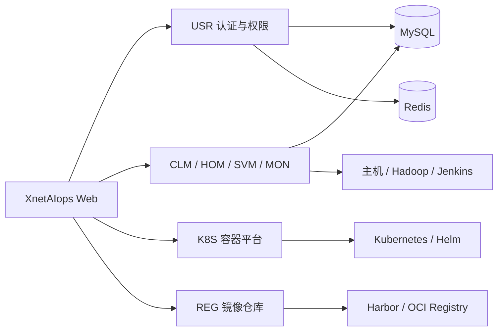

<div align="center">

# XnetAIops

**面向基础设施、服务与 Kubernetes 的智能运维平台**

[](https://www.xnetaiops.synapxnet.cn)
[](https://www.oracle.com/java/)
[](https://spring.io/projects/spring-boot)
[](./LICENSE)

[在线体验](https://www.xnetaiops.synapxnet.cn) · [OpenXnet 开源社区](https://openxnet.synapxnet.com) · [查看许可](./LICENSE)

</div>



## 项目简介

XnetAIops 是由 **SynapXnet 团队**开源的智能运维平台，面向服务器、基础软件、业务服务、Kubernetes 集群与镜像仓库等运维对象，提供从资源纳管、部署交付到监控告警的统一工作台。

项目采用模块化微服务架构，将集群生命周期、主机资产、服务编排、可观测性、权限控制等能力拆分为独立服务，便于按场景组合、扩展和二次开发。

## 核心能力

| 模块 | 服务目录 | 说明 |
| --- | --- | --- |
| 3D 总览 | Web 展示层 | 以三维视图呈现集群、节点及拓扑关系，快速建立基础设施全局视角 |
| CLM 集群管理 | `aiops-clm-service` | 管理集群生命周期，支持 MySQL、Redis、Hadoop、Jenkins 等基础组件的部署与运维 |
| HOM 主机管理 | `aiops-hom-service` | 管理主机、机架、SSH 连通性与基础设施资产，为自动化部署提供资源底座 |
| SVM 服务管理 | `aiops-svm-service` | 提供服务概览、命令中心、框架管理及服务启停、部署和生命周期管理 |
| MON 监控告警 | `aiops-mon-service` | 汇聚监控看板、告警历史与告警规则，帮助定位基础设施和服务异常 |
| K8S 容器平台 | `aiops-k8s-service` | 管理集群、节点、命名空间、工作负载、存储、网络、RBAC、Helm、流水线与部署计划 |
| REG 仓库管理 | `aiops-reg-service` | 管理镜像仓库、项目、制品标签、同步任务、仓库端点与部署日志 |
| USR 系统管理 | `aiops-usr-service` | 提供登录认证、用户、角色与访问权限管理，支撑平台级权限控制 |

## 技术架构



后端基于 Java 17、Spring Boot 3.4.6 与 MyBatis 构建，使用 Maven 管理多模块工程，并通过 Docker Compose 组织前端代理和各微服务容器。

## 目录结构

```text
XnetAIops/
├── aiops-clm-service/    # 集群生命周期
├── aiops-hom-service/    # 主机与机架资产
├── aiops-svm-service/    # 服务管理
├── aiops-mon-service/    # 监控告警
├── aiops-usr-service/    # 用户与权限
├── aiops-k8s-service/    # Kubernetes 管理
├── aiops-reg-service/    # 镜像仓库管理
├── nginx/                # 反向代理配置
├── XnetAIops.sql         # 数据库初始化脚本
└── docker-compose.yml    # 容器编排
```

## 快速开始

### 环境要求

- JDK 17+
- Maven 3.9+
- Docker 与 Docker Compose
- MySQL 8.x、Redis 7.x

### 构建后端

```bash
mvn -DskipTests package
```

### 容器启动

复制环境变量模板并配置数据库、Redis 及外部基础设施连接；如需同时启动 Web，请先构建同级的 `XnetAIops-web` 仓库，并确认 `WEB_DIST_PATH` 指向前端产物。

```bash
cp .env.example .env
docker compose up -d --build
docker compose ps
```

生产环境请使用独立的密钥、强密码和受限网络策略，不要沿用演示环境配置。

## 在线体验

- 访问地址：<https://www.xnetaiops.synapxnet.cn>
- 演示手机号：`12345678900`
- 演示验证码：`000000`

固定验证码仅用于开源项目展示，不应作为生产环境认证方案。

## SynapXnet 开源生态

XnetAIops 是 SynapXnet 开源体系的一部分。更多团队项目、技术方向与社区动态请访问 [OpenXnet](https://openxnet.synapxnet.com)。

## 参与贡献

欢迎通过 Issue 提交缺陷、需求和改进建议。提交代码前，请保持模块边界清晰，并为关键业务变更补充必要的测试与说明。

## 开源许可

本项目基于 [MIT License](./LICENSE) 开源。你可以自由使用、修改和分发本项目，但须保留原始版权与许可声明。
