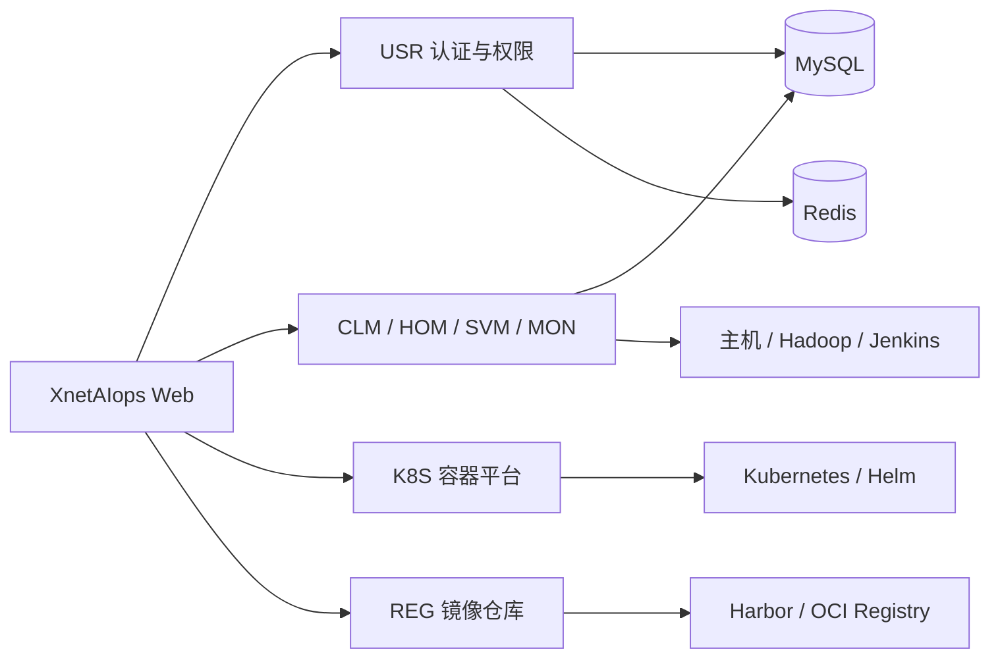

<div align="center">

# XnetAIops

**面向基础设施、服务与 Kubernetes 的智能运维平台**

[](https://github.com/synapxnet/XnetAIops/releases/tag/v1.3.0)
[](https://www.oracle.com/java/)
[](https://spring.io/projects/spring-boot)
[](./LICENSE)

[在线体验](https://goai.xnetaiops.synapxnet.online) · [前端仓库 XnetAIops-web](https://github.com/synapxnet/XnetAIops-web/tree/v1.3.0) · [OpenXnet 开源社区](https://openxnet.synapxnet.com) · [查看许可](./LICENSE)

</div>

## GOAI 决赛版 · v1.3.0

[发布页与校验文件](https://github.com/synapxnet/XnetAIops/releases/tag/v1.3.0) · [下载源码 ZIP](https://github.com/synapxnet/XnetAIops/releases/download/v1.3.0/XnetAIops-v1.3.0-0ccbeab1-source.zip) · [查看 v1.3.0 源码](https://github.com/synapxnet/XnetAIops/tree/v1.3.0) · [配套前端 XnetAIops-web](https://github.com/synapxnet/XnetAIops-web/releases/tag/v1.3.0) · [OpenXnet 桌面安装包](https://github.com/synapxnet/OpenXnet/releases/tag/v1.3.0)

> GOAI 产品版本为 **v1.3.0**。固定标签和发布附件对应正式交付；此后的 README 更新不会改变已发布制品。

平台驻场 Agent 提供运维专业证据，由 OpenXnet 与 AgentTeams 组织跨域协作。后端以审批核验、资源版本、幂等与持久检查点约束受控执行，读取服务与执行服务分离。

部署依赖、实测结果和能力边界见[本仓源码交付与构建说明](./docs/GOAI-FINALS-V1.3.0-SOURCE-DELIVERY.md)。发布源码不代表线上服务已重新部署。

> 下方为历史界面截图，仅用于了解原有功能与布局，不作为 v1.3.0 新界面的验收证据。


## 项目简介

XnetAIops 是由 **SynapXnet 团队**开源的智能运维平台，面向服务器、基础软件、业务服务、Kubernetes 集群与镜像仓库等运维对象，提供从资源纳管、部署交付到监控告警的统一工作台。

本仓库是平台后端，与 [XnetAIops-web](https://github.com/synapxnet/XnetAIops-web/tree/v1.3.0) 前端仓库共同组成企业级、多租户、前后端分离系统。项目采用模块化微服务架构，将集群生命周期、主机资产、服务编排、可观测性、租户权限控制等能力拆分为独立服务，便于按场景组合、扩展和二次开发。

## 项目优势

- **企业多租户**：通过用户、角色、权限与资源边界服务不同组织和团队。
- **前后端分离**：Web 控制台和后端服务独立演进，可按现有基础设施灵活集成。
- **模块化交付**：各业务服务边界清晰，支持整体部署或按场景扩展。
- **工程化部署**：提供 Maven 与 Docker Compose 工作流，便于本地验证和容器化交付。
- **持续更新**：SynapXnet 团队会持续完善自动化、可观测性、安全性与文档。

## 核心能力

| 模块 | 服务目录 | 说明 |
| --- | --- | --- |
| 3D 总览 | Web 展示层 | 以三维视图呈现集群、节点及拓扑关系，快速建立基础设施全局视角 |
| CLM 集群管理 | `aiops-clm-service` | 管理集群生命周期，支持 MySQL、Redis、Hadoop、Jenkins 等基础组件的部署与运维 |
| HOM 主机管理 | `aiops-hom-service` | 管理主机、机架、SSH 连通性与基础设施资产，为自动化部署提供资源底座 |
| SVM 服务管理 | `aiops-svm-service` | 提供服务概览、命令中心、框架管理及服务启停、部署和生命周期管理 |
| MON 监控告警 | `aiops-mon-service` | 汇聚监控看板、告警历史与告警规则，帮助定位基础设施和服务异常 |
| K8S 容器平台 | `aiops-k8s-service` | 管理集群、节点、命名空间、工作负载、存储、网络、RBAC、Helm、流水线与部署计划 |
| REG 仓库管理 | `aiops-reg-service` | 管理镜像仓库、项目、制品标签、同步任务、仓库端点与部署日志 |
| USR 系统管理 | `aiops-usr-service` | 提供登录认证、用户、角色与访问权限管理，支撑平台级权限控制 |

## 技术架构



后端基于 Java 17、Spring Boot 3.4.6 与 MyBatis 构建，使用 Maven 管理多模块工程，并通过 Docker Compose 组织前端代理和各微服务容器。

## 目录结构

```text
XnetAIops/
├── aiops-clm-service/    # 集群生命周期
├── aiops-hom-service/    # 主机与机架资产
├── aiops-svm-service/    # 服务管理
├── aiops-mon-service/    # 监控告警
├── aiops-usr-service/    # 用户与权限
├── aiops-k8s-service/    # Kubernetes 管理
├── aiops-reg-service/    # 镜像仓库管理
├── nginx/                # 反向代理配置
├── XnetAIops.sql         # 数据库初始化脚本
└── docker-compose.yml    # 容器编排
```

## v1.3.0 获取与构建

本节针对固定的 GOAI `v1.3.0`。环境为 JDK 17、Maven 3.9、MySQL 8.x、Redis 7.x；后端使用 Spring Boot 3.4.6 与 MyBatis。不要把默认 `display` 分支当作决赛源码：

```bash
git clone --branch v1.3.0 --depth 1 https://github.com/synapxnet/XnetAIops.git
cd XnetAIops
mvn -B -DskipTests package
```

构建产物位于各服务 `target/*-1.3.0.jar`，这一步只构建。测试命令、跳过项与已知边界见上方源码交付说明。

### 部署准备与边界

1. 准备外部 MySQL 和 Redis，按数据库实际状态审阅 `XnetAIops.sql`、K8s/DevOps 表和 `database/migrations`，先备份再执行所需初始化或迁移；仓库并非自动初始化的整套数据库镜像。
2. 从 `.env.example` 创建本地配置，填写数据库、Redis、`K8S_ENCRYPTION_KEY` 等。USR 还要求 `JWT_SECRET`，当前通用 Compose 未传入该变量，须通过专用 override 或现有编排向 `aiops-usr-service` 注入；仅复制 `.env` 不能完成全部配置。
3. 配套前端也获取 `v1.3.0` 并构建，将 `WEB_DIST_PATH` 指向其 `apps/web-antd/dist`。通用 Compose 的 Web 默认端口为 `81`；内部 USR 为 `9185`，CLM/HOM/SVM/MON/K8S/REG 分别为 `9181/9182/9183/9184/9186/9187`。公网经 HTTPS 网关访问，不把开发端口当作线上地址。
4. 通用 Compose 只覆盖原生平台服务，不包含驻场 Agent、AgentTeams、审批服务或 reader/checkpoint 分工。驻场独立服务来自 OpenXnet 固定版本，须另配 `/api/resident/v1/` 网关转发；参考源码交付说明，不能声称单条 Compose 已复现完整决赛链路。

完成配置后再在隔离环境使用 `docker compose up -d --build` 和 `docker compose ps`。不要对已有比赛部署直接套用通用 Compose 覆盖当前状态。

## 在线体验与登录

- 当前 GOAI 演示入口：<https://goai.xnetaiops.synapxnet.online/#/auth/login>。
- 演示手机号：`17870171303`；演示验证码：`000000`（6 位，仅用于本演示环境）。
- 登录方式为“手机号 + 验证码”，不使用 OpenXnet 桌面端的密码登录。当前页面不发送短信，演示验证码由项目方约定。
- 2026-09-18 已核验：登录成功，身份为 `goai_operator` / `OPERATOR`；页面标题为 `XnetAIops`，驻场状态返回 `platform=aiops`、`agentVersion=1.3.0`、`ONLINE`。
- 此验证码只用于平台登录。AgentTeams 演示访问码、Live 执行授权和模型 API Key 是独立凭据，不可互换；后者不在公开 README 提供。

API 网关与网页同源，基址为 `https://goai.xnetaiops.synapxnet.online`。登录为 `POST /api/usr/login`；身份读取为 `GET /api/usr/user/info`；驻场状态为 `GET /api/resident/v1/status`，后两项使用平台登录返回的 Bearer 令牌。业务模块前缀为 `/api/clm`、`/api/hom`、`/api/svm`、`/api/mon`、`/api/k8s`、`/api/reg`。

本轮仅执行登录及身份/驻场状态读取，未执行业务变更或模型调用。`modelConfigured=true` 表示存在服务端配置，不等于本轮已验证模型推理。公共演示账号不应用作生产认证方案。

## SynapXnet 开源生态

XnetAIops 是 SynapXnet 开源体系的一部分。更多团队项目、技术方向与社区动态请访问 [OpenXnet](https://openxnet.synapxnet.com)。

## 参与贡献

欢迎通过 Issue 提交缺陷、需求和改进建议。提交代码前，请保持模块边界清晰，并为关键业务变更补充必要的测试与说明。

## 开源许可

本项目基于 [MIT License](./LICENSE) 开源。你可以自由使用、修改和分发本项目，但须保留原始版权与许可声明。
